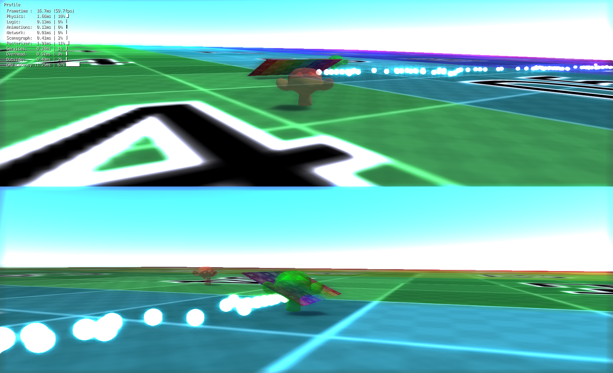

The-Monkey-Game
===============

I don't know what this is Why would I know what this is? Ask Sean Cooke, he might know.

##Screenshot

##Features
- 2 player co-op with split screen
- Bloom shaders
- 2x more monkeys
- More balls
- More sky

##Prerequisites
In order to run test builds of the game, you must have Blender 2.72b or newer in order to open the Blend files (located in the repository). You can get Blender at [blender.org](http://www.blender.org/). Once opened, you will need to press "P" to run the game. Executable builds will be released later on in development.

##Controls
####Player 1:
- W = Forwards
- S = Backwards
- A D = Turn left/right
- Q = Throw ball(s)
- F = Flashlight
- T = Set spawn

####Player 2:
- Up Arrow = Forwards
- Down Arrow = Backwards
- Left/Right Arrow = Turn left/right
- Right Ctrl = Throw ball(s)
- Return/Enter = Flashlight
